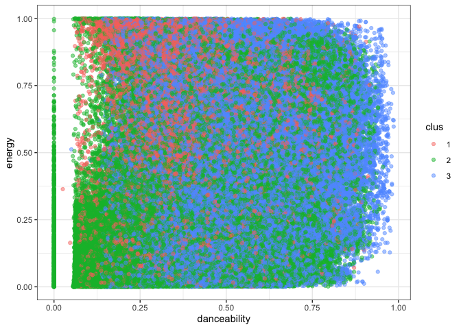

Proyecto 2
================
Rafael Leyton y Misael Fernandez
21-05-2021

\#\#Cargamos las librerias que posiblemente seran utilizadas

ademas cargamos los datos y los visualizamos, para de este modo saber
cuales serán utilizados

``` r
library(readxl)
library(datasets)
library(tidyverse)
```

    ## ── Attaching packages ─────────────────────────────────────── tidyverse 1.3.1 ──

    ## ✓ ggplot2 3.3.3     ✓ purrr   0.3.4
    ## ✓ tibble  3.1.2     ✓ dplyr   1.0.6
    ## ✓ tidyr   1.1.3     ✓ stringr 1.4.0
    ## ✓ readr   1.4.0     ✓ forcats 0.5.1

    ## ── Conflicts ────────────────────────────────────────── tidyverse_conflicts() ──
    ## x dplyr::filter() masks stats::filter()
    ## x dplyr::lag()    masks stats::lag()

``` r
library(dplyr)
library(tidyr)
library(stringr)
library(quanteda)
```

    ## Package version: 3.0.0
    ## Unicode version: 13.0
    ## ICU version: 69.1

    ## Parallel computing: 4 of 4 threads used.

    ## See https://quanteda.io for tutorials and examples.

``` r
library(ggplot2)
library(utf8)

load("/Users/pbenucci/Downloads/beats.RData")
Datos= as.data.frame(beats)
```

\#\#seleccionamos las columnas que nos serán utiles para el analisis

estas columnas cuentan con datoss numericos, por lo que serán utiles
para desarrollar los analisis, la unica columna con dato tipo char la
cual se deja es la del nombre de la cancion, igual se encuentra la
columna de tiempo la cual no se utilizará para el analisis, pero será
una mauske herramienta misteriosa que nos ayudará más tarde a definir el
largo de la lista.

se realiza un summary para ver a que corresponden los datos

se selecciona “BOOKET T” como temon para realizar las pruebas y se crea
un data.frame solo con ese tema

``` r
Datos_analisis= Datos[c(1,8:18,23,27)]
##hay que pasar todo a minuscula para no cometer errores 
##seleccionamos una canción base para realizar la recomendación 

summary(Datos_analisis)
```

    ##  artist_name         danceability        energy            key        
    ##  Length:447622      Min.   :0.0000   Min.   :0.0000   Min.   : 0.000  
    ##  Class :character   1st Qu.:0.2520   1st Qu.:0.0756   1st Qu.: 2.000  
    ##  Mode  :character   Median :0.3700   Median :0.2100   Median : 5.000  
    ##                     Mean   :0.3911   Mean   :0.3405   Mean   : 5.061  
    ##                     3rd Qu.:0.5140   3rd Qu.:0.5820   3rd Qu.: 8.000  
    ##                     Max.   :0.9860   Max.   :1.0000   Max.   :11.000  
    ##     loudness            mode         speechiness       acousticness   
    ##  Min.   :-60.000   Min.   :0.0000   Min.   :0.00000   Min.   :0.0000  
    ##  1st Qu.:-24.445   1st Qu.:0.0000   1st Qu.:0.03780   1st Qu.:0.3940  
    ##  Median :-19.477   Median :1.0000   Median :0.04430   Median :0.9230  
    ##  Mean   :-18.672   Mean   :0.6834   Mean   :0.06892   Mean   :0.6987  
    ##  3rd Qu.:-11.644   3rd Qu.:1.0000   3rd Qu.:0.05840   3rd Qu.:0.9860  
    ##  Max.   :  0.496   Max.   :1.0000   Max.   :0.97100   Max.   :0.9960  
    ##  instrumentalness     liveness         valence           tempo       
    ##  Min.   :0.00000   Min.   :0.0000   Min.   :0.0000   Min.   :  0.00  
    ##  1st Qu.:0.00169   1st Qu.:0.0968   1st Qu.:0.0894   1st Qu.: 82.39  
    ##  Median :0.71500   Median :0.1230   Median :0.2740   Median :105.72  
    ##  Mean   :0.50607   Mean   :0.2217   Mean   :0.3374   Mean   :108.74  
    ##  3rd Qu.:0.90100   3rd Qu.:0.2530   3rd Qu.:0.5370   3rd Qu.:131.05  
    ##  Max.   :1.00000   Max.   :1.0000   Max.   :0.9960   Max.   :244.95  
    ##   duration_ms       track_name       
    ##  Min.   :   1066   Length:447622     
    ##  1st Qu.: 123440   Class :character  
    ##  Median : 194961   Mode  :character  
    ##  Mean   : 229110                     
    ##  3rd Qu.: 271560                     
    ##  Max.   :4796395

``` r
cancion = "BOOKER T"

Fila_comparacion = Datos_analisis[Datos_analisis$track_name == "BOOKER T",]
```

\#\#limpieza de datos

como pudimos ver, todos los datos, menos tempo, loudness y duration\_ms
se encuentran en un rango de 0 a 1, para hacer una limpieza de datos se
decidió realizarla con el Loudness, para de este modo tener una escucha
más pareja para el oyente, evitando subir y bajar el volumen

``` r
boxplot(Datos_analisis$loudness, horizontal = TRUE)
```

<!-- -->

``` r
boxplot.stats(Datos_analisis$loudness)
```

    ## $stats
    ## [1] -43.6420 -24.4450 -19.4765 -11.6440   0.4960
    ## 
    ## $n
    ## [1] 447622
    ## 
    ## $conf
    ## [1] -19.50673 -19.44627
    ## 
    ## $out
    ##   [1] -47.332 -45.717 -47.332 -44.830 -43.905 -43.976 -47.655 -43.824 -44.286
    ##  [10] -46.770 -45.045 -44.466 -45.951 -43.796 -48.120 -45.880 -44.466 -45.951
    ##  [19] -43.796 -48.120 -45.880 -44.452 -45.901 -43.804 -48.102 -45.929 -44.352
    ##  [28] -44.712 -47.013 -46.153 -60.000 -60.000 -60.000 -44.063 -44.063 -44.098
    ##  [37] -44.091 -45.361 -45.361 -44.098 -44.091 -44.098 -44.091 -44.098 -44.091
    ##  [46] -44.098 -44.091 -47.332 -44.098 -44.091 -44.098 -44.091 -47.332 -44.098
    ##  [55] -44.091 -44.098 -44.091 -44.098 -44.091 -44.098 -44.091 -44.098 -44.091
    ##  [64] -44.098 -44.091 -44.098 -44.091 -44.098 -44.091 -44.098 -44.091 -44.098
    ##  [73] -44.091 -44.098 -44.091 -44.098 -44.091 -44.098 -44.091 -44.098 -44.091
    ##  [82] -44.098 -44.091 -44.098 -44.091 -45.267 -45.099 -45.099 -45.260 -45.074
    ##  [91] -45.074 -45.292 -45.260 -43.833 -45.260 -44.345 -44.670 -43.833 -44.176
    ## [100] -44.176 -44.176 -44.758 -47.332 -47.332 -45.070 -43.710 -43.691 -45.672
    ## [109] -43.763 -44.554 -43.750 -43.959 -44.937 -44.393 -44.694 -43.964 -45.597
    ## [118] -46.349 -44.262 -45.672 -43.878 -45.062 -44.289 -60.000 -60.000 -46.018
    ## [127] -45.015 -43.769 -44.810 -44.810 -44.810 -44.810 -48.231 -45.164 -48.265
    ## [136] -44.810 -44.810 -43.927 -44.810 -44.810 -44.810 -44.810 -44.810 -44.810
    ## [145] -44.810 -44.810 -44.522 -44.810 -44.810 -44.810 -44.810 -44.810 -44.810
    ## [154] -44.810 -44.810 -44.784 -43.851 -45.008 -44.470 -47.268 -44.418 -45.008
    ## [163] -48.231 -45.125 -48.265 -45.223 -43.851 -43.779 -46.507 -43.787 -44.714
    ## [172] -47.847 -44.429 -43.681 -44.549 -44.401 -45.240 -45.345 -48.474 -45.001
    ## [181] -43.895 -44.126 -44.631 -43.744 -44.435 -46.905 -47.298 -44.487 -47.298
    ## [190] -47.298 -44.845 -44.218 -44.093 -44.338 -44.093 -44.338 -44.833 -43.851
    ## [199] -46.146 -44.338 -46.146 -44.833 -43.851 -44.338 -44.093 -44.338 -44.338
    ## [208] -44.338 -44.338 -44.338 -44.093 -44.338 -46.238 -44.556 -45.675 -44.338
    ## [217] -44.338 -44.093 -44.338 -44.093 -44.338 -44.338 -44.093 -44.338 -44.338
    ## [226] -44.093 -44.338 -44.338 -44.093 -44.338 -44.338 -44.338 -44.338 -44.338
    ## [235] -44.338 -44.338 -44.338 -44.338 -44.093 -44.338 -44.093 -44.338 -44.093
    ## [244] -44.338 -44.338 -44.093 -44.338 -44.338 -44.093 -44.093 -44.338 -44.338
    ## [253] -44.338 -44.338 -44.338 -44.338 -44.338 -44.093 -44.093 -44.338 -44.093
    ## [262] -44.338 -44.338 -44.338 -44.338 -44.338 -44.338 -44.093 -44.338 -44.338
    ## [271] -44.338 -44.093 -44.093 -44.338 -44.338 -44.338 -44.093 -44.338 -44.338
    ## [280] -44.338 -44.093 -44.338 -44.093 -44.338 -44.338 -44.338 -44.093 -44.338
    ## [289] -44.093 -44.338 -44.338 -44.338 -44.338 -44.338 -44.093 -44.338 -43.830
    ## [298] -44.338 -44.338 -44.338 -44.338 -44.338 -44.338 -44.093 -44.338 -44.338
    ## [307] -44.338 -44.338 -44.338 -44.338 -44.338 -44.338 -43.853 -44.338 -44.093
    ## [316] -44.338 -44.093 -44.338 -44.338 -44.093 -44.338 -44.338 -44.338 -44.093
    ## [325] -44.338 -44.338 -44.338 -44.093 -44.338 -44.338 -44.338 -44.093 -44.338
    ## [334] -44.338 -44.338 -44.338 -44.338 -44.338 -44.338 -44.338 -44.338 -44.487
    ## [343] -46.379 -44.093 -44.338 -44.093 -44.338 -44.338 -44.338 -44.093 -44.338
    ## [352] -44.338 -44.848 -44.338 -44.338 -45.362 -44.338 -44.093 -44.338 -43.647
    ## [361] -44.634 -45.494 -44.338 -44.093 -44.338 -44.093 -44.338 -44.338 -44.338
    ## [370] -45.362 -44.640 -46.381 -44.357 -45.434 -45.362 -44.338 -45.362 -43.785
    ## [379] -44.338 -44.338 -45.362 -44.348 -45.434 -46.238 -49.025 -45.362 -44.338
    ## [388] -43.778 -44.357 -44.338 -44.093 -44.338 -44.093 -44.338 -44.338 -45.434
    ## [397] -45.362 -45.362 -45.362 -44.338 -44.338 -44.338 -44.093 -44.338 -52.838
    ## [406] -44.487 -45.362 -44.338 -44.338 -45.362 -46.238 -45.362 -44.338 -43.837
    ## [415] -44.338 -44.487 -44.338 -44.338 -44.487 -45.362 -44.093 -44.338 -44.487
    ## [424] -46.379 -44.487 -45.362 -44.338 -44.338 -44.338 -45.362 -43.838 -44.338
    ## [433] -45.362 -44.338 -45.362 -44.338 -44.338 -45.539 -47.305 -44.818 -45.928
    ## [442] -47.857 -44.338 -44.338 -44.338 -44.338 -44.338 -45.812 -44.338 -44.338
    ## [451] -44.338 -45.362 -45.362 -46.238 -44.338 -44.338 -45.362 -47.330 -44.668
    ## [460] -47.864 -45.898 -46.080 -45.362 -44.338 -45.746 -45.362 -44.341 -46.379
    ## [469] -44.487 -45.362 -45.779 -45.362 -46.238 -45.805 -44.338 -45.362 -44.338
    ## [478] -45.362 -45.434 -45.362 -44.338 -44.338 -44.338 -45.782 -44.565 -45.362
    ## [487] -44.338 -44.338 -44.634 -52.838 -43.783 -46.079 -45.773 -47.340 -45.887
    ## [496] -45.539 -47.861 -44.811 -44.658 -49.025 -48.783 -44.634 -45.362 -45.362
    ## [505] -52.838 -44.093 -45.362 -44.338 -44.093 -48.783 -46.238 -44.552 -44.338
    ## [514] -45.362 -45.362 -44.634 -49.025 -45.362 -45.362 -44.093 -44.338 -45.362
    ## [523] -44.821 -47.332 -46.066 -47.859 -45.935 -48.783 -45.362 -44.338 -52.838
    ## [532] -45.362 -52.838 -45.362 -45.362 -44.093 -44.338 -45.362 -43.823 -44.093
    ## [541] -44.338 -45.362 -48.783 -44.357 -44.093 -44.338 -44.338 -44.338 -44.338
    ## [550] -44.093 -44.338 -45.736 -45.362 -44.093 -44.338 -44.093 -44.338 -44.093
    ## [559] -44.338 -43.833 -45.362 -45.362 -45.362 -45.362 -48.783 -43.776 -44.917
    ## [568] -44.093 -44.338 -45.362 -44.093 -44.338 -49.025 -44.917 -43.785 -46.238
    ## [577] -45.362 -45.804 -46.238 -45.362 -48.783 -46.238 -45.803 -46.238 -48.783
    ## [586] -45.362 -43.778 -49.025 -44.093 -44.338 -44.093 -44.338 -44.093 -44.338
    ## [595] -45.362 -45.362 -45.323 -45.362 -46.238 -48.783 -45.362 -45.362 -45.805
    ## [604] -46.238 -44.093 -44.338 -45.739 -45.362 -45.362 -45.362 -44.093 -44.338
    ## [613] -44.093 -44.338 -45.362 -44.234 -43.647 -44.093 -44.338 -45.362 -43.796
    ## [622] -48.783 -43.835 -46.238 -46.238 -45.436 -45.362 -43.835 -45.362 -45.362
    ## [631] -43.846 -45.362 -44.917 -45.436 -43.647 -45.434 -44.634 -49.025 -52.838
    ## [640] -46.238 -43.784 -48.783 -45.434 -49.025 -44.634 -48.783 -45.436 -45.362
    ## [649] -46.238 -44.634 -45.362 -45.362 -45.362 -45.362 -43.779 -44.917 -48.783
    ## [658] -43.778 -45.526 -48.783 -44.357 -43.782 -44.634 -43.779 -48.783 -48.783
    ## [667] -45.522 -44.917 -45.436 -43.647 -46.238 -45.520 -45.436 -48.783 -49.025
    ## [676] -46.238 -46.238 -45.362 -44.232 -46.238 -45.362 -45.362 -45.434 -52.838
    ## [685] -44.634 -45.436 -49.025 -43.647 -46.238 -43.779 -46.238 -46.336 -44.634
    ## [694] -45.362 -44.357 -48.783 -45.436 -45.362 -46.238 -48.783 -44.634 -45.362
    ## [703] -52.838 -43.647 -45.362 -43.786 -48.783 -44.357 -45.362 -43.776 -45.362
    ## [712] -46.238 -48.783 -46.238 -48.783 -44.634 -43.780 -45.436 -44.208 -49.025
    ## [721] -43.778 -43.647 -43.787 -46.238 -45.362 -44.206 -45.436 -45.362 -48.783
    ## [730] -60.000 -60.000 -60.000 -60.000 -60.000 -60.000 -60.000 -60.000 -60.000
    ## [739] -60.000 -60.000 -60.000 -60.000 -60.000 -60.000 -60.000 -60.000 -60.000
    ## [748] -44.098 -43.790 -44.853 -44.853 -43.739 -44.365 -43.685 -44.365 -43.685
    ## [757] -43.948 -46.068 -44.595 -44.595 -44.632 -45.400 -44.632 -44.041 -43.926
    ## [766] -43.837 -43.831 -43.827 -43.825 -43.852 -43.851 -43.830 -43.818 -43.833
    ## [775] -43.872 -43.846 -44.338 -46.238 -45.362 -45.494 -48.783 -52.838 -49.025
    ## [784] -43.647 -44.917 -45.434 -52.838 -49.025 -46.238 -44.634 -45.434 -45.434
    ## [793] -52.838 -44.357 -43.784 -52.838 -48.783 -43.837 -43.827 -43.843 -43.841
    ## [802] -43.836 -44.593 -47.432 -47.494 -47.494 -47.432 -47.494 -47.432 -47.494
    ## [811] -47.432 -47.494 -47.432 -44.020 -45.237 -47.494 -47.432 -47.494 -47.432
    ## [820] -47.432 -44.020 -47.494 -47.432 -47.494 -47.432 -47.494 -47.432 -47.432
    ## [829] -47.432 -47.493 -47.432 -44.020 -45.237 -47.493 -47.432 -44.020 -45.237
    ## [838] -49.077 -47.332 -47.332 -51.718 -52.819 -60.000 -60.000 -47.767 -46.161

``` r
canciones_sinout <- Datos_analisis[Datos_analisis$loudness > -43.6419,]

boxplot(canciones_sinout$loudness, horizontal = TRUE)
```

<!-- -->

``` r
boxplot.stats(canciones_sinout$loudness)
```

    ## $stats
    ## [1] -43.6070 -24.4280 -19.4540 -11.6205   0.4960
    ## 
    ## $n
    ## [1] 446775
    ## 
    ## $conf
    ## [1] -19.48427 -19.42373
    ## 
    ## $out
    ## numeric(0)

\#\#para evitar repetir canciones, limpiamos las canciones repetidas

``` r
canciones_sinout_unique<-unique(canciones_sinout)
```

\#\#Con una primera limpieza queda sin Outliers

\#\#Procedemos a hacer un modelo de Kmedias para comenzar

``` r
modelo_kme <- kmeans(canciones_sinout_unique[c(2:12)], centers = 3)

canciones_sinout_unique$clus <- modelo_kme$cluster %>% as.factor()

ggplot(canciones_sinout_unique, aes(danceability, energy, color=clus)) +
  geom_point(alpha=0.5, show.legend = T) +
  theme_bw()
```

<!-- -->

``` r
info_clus <- modelo_kme$centers

info_clus
```

    ##   danceability    energy      key  loudness      mode speechiness acousticness
    ## 1    0.4039221 0.4848836 5.112458 -13.36514 0.6945108  0.08279620    0.5115921
    ## 2    0.3658717 0.2523444 5.065821 -19.38161 0.6715629  0.06788337    0.7753119
    ## 3    0.4812616 0.4124191 5.106279 -15.05486 0.6715131  0.06474850    0.5886489
    ##   instrumentalness  liveness   valence     tempo
    ## 1        0.3146520 0.2329359 0.4511659 164.40441
    ## 2        0.5112701 0.1862442 0.2952018  82.45131
    ## 3        0.3975152 0.2150239 0.4054410 123.46168

## Evolución suma de cuadrados intra-cluster en la medida que aumentamos el numero de k

``` r
SSinterior <- numeric(15)
for(k in 1:15){
  modelo <-kmeans(canciones_sinout_unique[c(2:12)], centers = k)
  SSinterior[k] <- modelo$tot.withinss
}
```

    ## Warning: Quick-TRANSfer stage steps exceeded maximum (= 13963550)

    ## Warning: Quick-TRANSfer stage steps exceeded maximum (= 13963550)

    ## Warning: Quick-TRANSfer stage steps exceeded maximum (= 13963550)

    ## Warning: did not converge in 10 iterations

``` r
plot(SSinterior)
```

<!-- -->

\#\#Estadistico de Hopkins

\#\#terminar el clustering

## dado que tuvimos dificultades para realizar el clustering, tomamos la desicion de crear un factor para realizar la seleccion

\#\#Variable para seleccion de lista recomendada

para la creación de la variable de comparación se utilizaran las
siguientes variables:

\#\#Danceability Energy Loudness Speechiness Acousticness
Instrumentalness Liveness Valence Tempo

Cada variable tendrá un mismo peso en la comparativa de canciones, la
idea es seleccionar la que más se parezca en composicion auditiva, donde
se utilizará un metodo matematico para evaluar la similitud entre
canciones y ordenar las simililares con un factor ponderado, a menor
facton ponderado, mayor es la similitud entre canciones.

cada variable equivaldrá a un 11.1% del factor ponderado, este se
calculará de la siguiente manera:

sea A1 el atributo a comparar de la cancion seleccionada y A2 el
atributo de la canción a comparar tendremos que la diferencia porcentual
entre estos atributos estará dada por el valor absoluto de

\#\#(A1-A2)/A1

Por lo tanto el ponderado final de la cancion a comparar será la
sumatoria de la diferencia porcentual por el factor ponderado, las
canciones con menos ponderado final, serán las recomendadas en un
comienzo.

Se utiliza este metodo para no utilizar el artista o genero para de este
modo, poder encontrar canciones nuevas o de artistas nuevos sin tanto
renombre

``` r
recomendadas <- canciones_sinout_unique[c(1,13,14)]
obs <- nrow(canciones_sinout_unique) 
factor<- 1/11

for (i in 1:obs) {
  aux_dance=(canciones_sinout_unique$danceability[i]-Fila_comparacion$danceability[1])/Fila_comparacion$danceability[1]
  aux_energy=(canciones_sinout_unique$energy[i]-Fila_comparacion$energy[1])/Fila_comparacion$energy[1]
  aux_loud=(canciones_sinout_unique$loudness[i]-Fila_comparacion$loudness[1])/Fila_comparacion$loudness[1]
  aux_speech=(canciones_sinout_unique$speechiness[i]-Fila_comparacion$speechiness[1])/Fila_comparacion$speechiness[1]
  aux_acoustic=(canciones_sinout_unique$acousticness[i]-Fila_comparacion$acousticness[1])/Fila_comparacion$acousticness[1]
  aux_instr=(canciones_sinout_unique$instrumentalness[i]-Fila_comparacion$instrumentalness[1])/Fila_comparacion$instrumentalness[1]
  aux_live=(canciones_sinout_unique$liveness[i]-Fila_comparacion$liveness[1])/Fila_comparacion$liveness[1]
  aux_valence=(canciones_sinout_unique$valence[i]-Fila_comparacion$valence[1])/Fila_comparacion$valence[1]
  aux_tempo=(canciones_sinout_unique$tempo[i]-Fila_comparacion$tempo[1])/Fila_comparacion$tempo[1]
  aux_mode=(canciones_sinout_unique$mode[i]-Fila_comparacion$tempo[1])/Fila_comparacion$mode[1]
  aux_key=(canciones_sinout_unique$key[i]-Fila_comparacion$tempo[1])/Fila_comparacion$key[1]
  
  recomendadas$ponderado[i] <- factor*abs(aux_dance)+factor*abs(aux_energy)+factor*abs(aux_loud)+factor*abs(aux_speech)+factor*abs(aux_acoustic)+factor*abs(aux_instr)+factor*abs(aux_live)+factor*abs(aux_valence)+factor*abs(aux_tempo)+factor*abs(aux_mode)+factor*abs(aux_key)
  
}
```

## Ordenamos las ponderadas de menor a mayor

de este modo obtendremos las que tienen mayor similitud para luego,
selecionar hasta que sumen 3 horas de reproduccion antes de esto,
eliminamos los duplicados

``` r
recomendadas<-recomendadas[with(recomendadas, order(recomendadas$ponderado)),]

duracion = 10800000
aux=0
j<-1
final <- data.frame(artista = character(), nombre_cancion = character())
while( aux < duracion) {
  aux<-aux+recomendadas$duration_ms[j]
  nueva.fila<-data.frame(artista = recomendadas$artist_name[j], nombre_cancion=recomendadas$track_name[j])
  final=rbind(final,nueva.fila)
  j=j+1
}
final
```

    ##                               artista
    ## 1                           Bad Bunny
    ## 2                             Pitbull
    ## 3            Bob Marley & The Wailers
    ## 4                                2Pac
    ## 5                 Marco Antonio Solís
    ## 6                            Chystemc
    ## 7                             Pitbull
    ## 8                           Lady Gaga
    ## 9                        Diego Torres
    ## 10                Marco Antonio Solís
    ## 11                               Sech
    ## 12                  Justin Timberlake
    ## 13                         Alex Bueno
    ## 14                Marco Antonio Solís
    ## 15                Marco Antonio Solís
    ## 16                    Black Eyed Peas
    ## 17                         Luis Fonsi
    ## 18                           DJ Snake
    ## 19                Marco Antonio Solís
    ## 20                          Bob Dylan
    ## 21                             Rels B
    ## 22                     Caetano Veloso
    ## 23                    Black Eyed Peas
    ## 24                         Ben Harper
    ## 25                            Outkast
    ## 26                          Daft Punk
    ## 27 Edward Sharpe & The Magnetic Zeros
    ## 28                Marco Antonio Solís
    ## 29                               Russ
    ## 30                      Justin Quiles
    ## 31                    Black Eyed Peas
    ## 32                                BTS
    ## 33                                BTS
    ## 34                    Black Eyed Peas
    ## 35                        Wyclef Jean
    ## 36                       ChocQuibTown
    ## 37                         Katy Perry
    ## 38                            America
    ## 39                               2Pac
    ## 40                       ChocQuibTown
    ## 41                              Train
    ## 42                         Alex Bueno
    ## 43                               2Pac
    ## 44                     Aterciopelados
    ## 45                         The Weeknd
    ## 46                          Lady Gaga
    ##                                              nombre_cancion
    ## 1                                                  BOOKER T
    ## 2                                                   Go Girl
    ## 3                                           Buffalo Soldier
    ## 4  Can U C The Pride In The Panther? - Album Version (Male)
    ## 5                                              Hasta Cuando
    ## 6                                        Real Rap Represent
    ## 7                                            Culo Miami Mix
    ## 8                                                Brown Eyes
    ## 9                       Hoy Es Domingo (feat. Rubén Blades)
    ## 10                                             Hasta Cuando
    ## 11                                     Que Mas Pues - Remix
    ## 12                    Say Something (feat. Chris Stapleton)
    ## 13                                             De Madrugada
    ## 14                                             Hasta Cuando
    ## 15                                             Hasta Cuando
    ## 16                                                  Release
    ## 17                                              Poco A Poco
    ## 18                                                Taki Taki
    ## 19                                             Hasta Cuando
    ## 20                                I Feel a Change Comin' On
    ## 21                                    Un Verano En Mallorca
    ## 22                                              Zera A Reza
    ## 23                                                     Sexy
    ## 24                                      Engraved Invitation
    ## 25                     Skew It on the Bar-B (feat. Raekwon)
    ## 26                                              Technologic
    ## 27                                                      Two
    ## 28                                        Un Par De Humanos
    ## 29                                        CIVIL WAR - Bonus
    ## 30                                          Sabanas Mojadas
    ## 31                                                     Sexy
    ## 32                                      내 방을 여행하는 법
    ## 33                                           Fly To My Room
    ## 34                                                     Sexy
    ## 35                                                  Hip Hop
    ## 36                                           Somos Pasifico
    ## 37                                                 Birthday
    ## 38                                          Dream Come True
    ## 39                        Loyal To The Game - DJ Quik Remix
    ## 40                                           Somos Pacifico
    ## 41                                            Meet Virginia
    ## 42                                    Solo Se Que Te Quiero
    ## 43                      Po Nigga Blues - Scott Storch Remix
    ## 44                                                Oye Mujer
    ## 45                                                  Starboy
    ## 46                                                 Hey Girl
